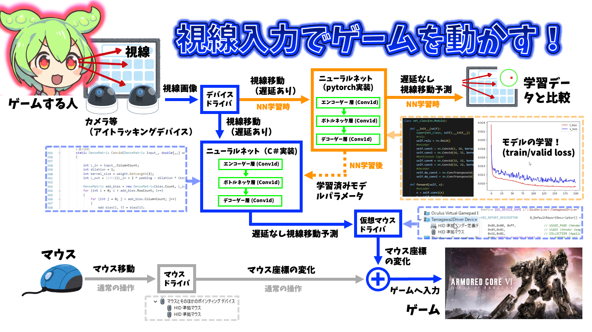

# 視線入力でゲームを動かすC#プログラム

## 注意！
こちらのリポジトリにある私が作ったデバイスドライバをインストールしてください。デバイスドライバがなければマウスを動かせません。また、tobii eye tracker 5を購入し、パソコンにつないでください。アイトラッカーがなければすべてのプログラムが動きません。
## 使い方
### データを取るとき
#### 目の位置のズレを取る場合
1. CaliCoodinateタブをクリックしてください
2. 次ボタンをクリックして保存するフォルダを選んでください
3. 見る目標のことをマルと表現します。左上のマルからデータを取得します。データはマルごとに2キーと1キーを押している間に取得されます。初めのマルは2キーを押している間に取得されます。
4. すべてのマルでデータを取ってください。

#### 目の時間のズレを取る場合
1. Predictionタブをクリックしてください。
2. TrackとFlickどちらで取るか選んでください。
3. Trackを選んだ場合は速度を、Flickを選んだ場合は座標を指定してください。
4. 次ボタンをクリックして保存するフォルダを選んでください。Trackを選んだ場合は速度0の時のデータもとって、それをTrackとは別のフォルダに保存してください
5. 2キーを押している間にデータを取ります。また、最初の3秒間はマルは止まっています。

### 実際に動かすとき
1. EyeTrackingタブを押すことで動きます。
2. F1キーを押すことで、見ている場所にマウスが動きます。
3. F12キーを押すことで最初の画面に戻ります。

